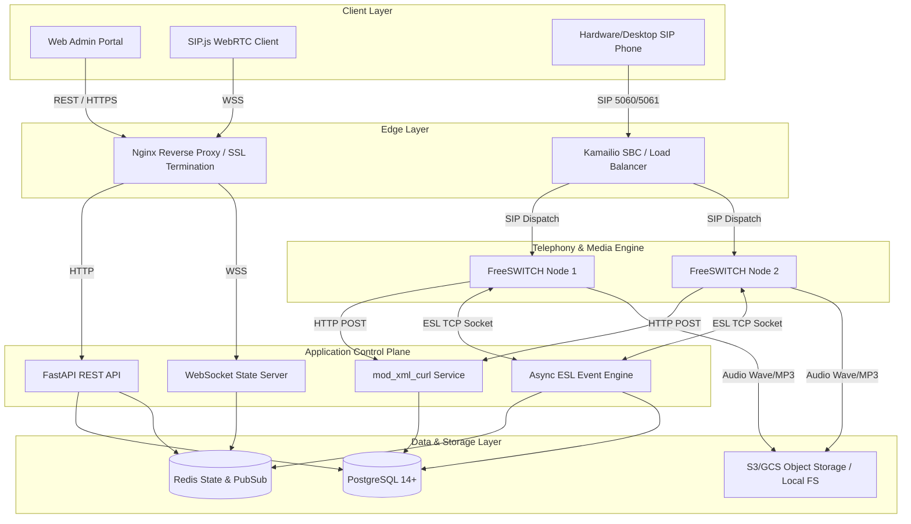
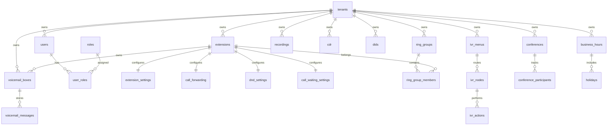

# Production-Grade Multi-Tenant PBX Platform Architecture Blueprint

## Executive Overview
This document defines the production-grade architectural specification for a multi-tenant PBX communications platform utilizing **FreeSWITCH 1.10.x** as the core media/telephony engine, **Python FastAPI** as the stateless control plane API, **PostgreSQL 14+** for persistent data and dynamic configuration storage via `mod_xml_curl`, **Redis** for real-time state caching, **Kamailio** as an optional SIP Session Border Controller (SBC) / Load Balancer, and **WebRTC (SIP.js/JsSIP)** for browser softphones.

---

## 1. Complete System Architecture

The system decouples the **Control Plane** (APIs, Database, Portal, ESL Event Listeners) from the **Data/Media Plane** (FreeSWITCH nodes, RTP routing, SIP handling).

```
                     ┌─────────────────────────────────────────┐
                     │          Web Admin Portal / Softphone   │
                     │          (React/Vue + SIP.js WebRTC)    │
                     └────────────────────┬────────────────────┘
                                          │ HTTP / WSS
                                          ▼
                     ┌─────────────────────────────────────────┐
                     │           Nginx Reverse Proxy           │
                     └────────────────────┬────────────────────┘
                                          │
                                          ▼
                     ┌─────────────────────────────────────────┐
                     │       FastAPI Control Plane API         │
                     │    - REST Services (RBAC & Tenant)      │
                     │    - Dynamic mod_xml_curl Endpoints      │
                     │    - Async ESL TCP Event Processor      │
                     │    - WebSocket Push Server              │
                     └──────────┬──────────────┬───────────────┘
                                │              │
                     ┌──────────┴───┐      ┌───┴───────────┐
                     │ PostgreSQL   │      │ Redis Cache   │
                     │ Persistence  │      │ & Pub/Sub     │
                     └──────────────┘      └───────────────┘
                                ▲
                                │ HTTP POST (XML Curl Requests)
                                │
                     ┌──────────┴──────────────────────────────┐
                     │          Kamailio SIP SBC Cluster       │
                     └────────────────────┬────────────────────┘
                                          │ SIP Load Balancing
                                          ▼
                     ┌─────────────────────────────────────────┐
                     │          FreeSWITCH Media Cluster       │
                     │        (Sofia SIP + RTP + IVR + ESL)    │
                     └────────────────────┬────────────────────┘
                                          │ Audio Streams
                                          ▼
                     ┌─────────────────────────────────────────┐
                     │      Recording Storage Provider         │
                     │      (Local FS / AWS S3 / MinIO / GCS)  │
                     └─────────────────────────────────────────┘
```

---

## 2. Component Diagram



---

## 3. Database Entity Relationship (ER) Diagram



---

## 4. Complete PostgreSQL Schema

The schema is defined in complete, migration-ready DDL format in `migrations/001_initial_schema.sql`. It contains 38 tables:
- `tenants`, `roles`, `permissions`, `users`, `user_roles`
- `extensions`, `extension_settings`
- `ring_groups`, `ring_group_members`, `hunt_groups`, `hunt_group_members`
- `call_forwarding`, `dnd_settings`, `call_waiting_settings`
- `parking_slots`, `pickup_groups`
- `ivr_menus`, `ivr_nodes`, `ivr_actions`
- `announcements`, `music_on_hold`
- `voicemail_boxes`, `voicemail_messages`
- `recording_policies`, `recordings`, `cdr`
- `sip_trunks`, `outbound_routes`, `outbound_route_patterns`, `dids`
- `conferences`, `conference_participants`
- `business_hours`, `holidays`
- `audit_logs`, `system_settings`, `storage_settings`, `email_settings`

---

## 5. Recommended Project Directory Structure

```
c:\PROJECTS\PBX\
├── docker-compose.yml
├── Dockerfile.api
├── Dockerfile.freeswitch
├── README.md
├── .env.example
├── migrations/
│   └── 001_initial_schema.sql
├── docs/
│   └── ARCHITECTURE.md
├── config/
│   ├── freeswitch/
│   │   ├── freeswitch.xml
│   │   ├── vars.xml
│   │   ├── autoload_configs/
│   │   │   ├── xml_curl.conf.xml
│   │   │   ├── event_socket.conf.xml
│   │   │   └── sofia.conf.xml
│   │   └── sip_profiles/
│   │       ├── internal.xml
│   │       └── external.xml
│   ├── nginx/
│   │   └── default.conf
│   └── kamailio/
│       └── kamailio.cfg
└── src/
    ├── __init__.py
    ├── main.py
    ├── core/
    │   ├── config.py
    │   ├── database.py
    │   ├── redis.py
    │   ├── security.py
    │   ├── permissions.py
    │   └── storage.py
    ├── esl/
    │   ├── client.py
    │   ├── listener.py
    │   └── parser.py
    ├── xml_curl/
    │   ├── router.py
    │   ├── directory.py
    │   ├── dialplan.py
    │   ├── configuration.py
    │   └── callcenter.py
    ├── api/
    │   ├── v1/
    │   │   ├── auth.py
    │   │   ├── tenants.py
    │   │   ├── users.py
    │   │   ├── extensions.py
    │   │   ├── ring_groups.py
    │   │   ├── hunt_groups.py
    │   │   ├── ivr.py
    │   │   ├── voicemail.py
    │   │   ├── recordings.py
    │   │   ├── cdr.py
    │   │   ├── dids.py
    │   │   ├── sip_trunks.py
    │   │   ├── conferences.py
    │   │   ├── business_hours.py
    │   │   ├── monitoring.py
    │   │   └── websockets.py
    ├── services/
    │   ├── extension_service.py
    │   ├── call_routing_service.py
    │   ├── recording_service.py
    │   ├── cdr_service.py
    │   └── voicemail_service.py
    └── utils/
        └── audio.py
```

---

## 6. FreeSWITCH Configuration Architecture

FreeSWITCH runs in a fully dynamic mode powered by `mod_xml_curl`. 
- **Static Configuration**: Minimal `freeswitch.xml` that defines basic modules (`mod_sofia`, `mod_xml_curl`, `mod_event_socket`, `mod_dither`, `mod_conference`, `mod_voicemail`, `mod_soundtouch`, `mod_native_file`).
- **Dynamic Fetches**: All directories, dialplans, configurations, and callcenter queues are fetched over HTTP POST from FastAPI `/freeswitch/xml`.
- **Dialplan Context Isolation**:
  - `public` context: Processes incoming external SIP traffic from trunks/carriers. Matches DIDs to tenants.
  - `tenant-{tenant_id}` context: Encapsulates internal tenant dialplans (extensions, ring groups, IVRs, feature codes).
  - `outbound` context: Outbound PSTN routing after tenant verification and CLI validation.

---

## 7. mod_xml_curl Architecture

When FreeSWITCH needs dynamic XML data, `mod_xml_curl` POSTs key-value request parameters to FastAPI:

### Request Parameters
- `section`: `directory`, `dialplan`, `configuration`, or `phrases`
- `tag_name`: `domain`, `user`, `condition`, etc.
- `key_name`: `domain`, `name`, `id`, etc.
- `key_value`: The domain string (e.g. `tenant-a.pbx.com`), user/extension (e.g. `1001`), etc.

### FastAPI Dynamic XML Generation Logic
1. **Directory Fetch (`section=directory`)**:
   - Matches `key_value` domain to tenant `sip_domain`.
   - Returns valid FreeSWITCH `<domain name="{sip_domain}">` with user credentials, variables (`user_context=tenant-{tenant_id}`), password, and voicemail settings.
2. **Dialplan Fetch (`section=dialplan`)**:
   - Evaluates context (`public` vs `tenant-{tenant_id}`).
   - Returns generated FreeSWITCH XML extensions, conditions, and actions (`bridge`, `transfer`, `answer`, `record_session`, `voicemail`, `python`, etc.).

---

## 8. Tenant Isolation Strategy

Tenant security is strictly enforced at every architectural layer:

1. **API Layer**: JWT tokens embed `tenant_id` and role. Authorization dependencies reject any request attempting to access or modify resources belonging to another `tenant_id`.
2. **Database Layer**: All multi-tenant tables include `tenant_id UUID NOT NULL REFERENCES tenants(id)`. All queries explicitly enforce `WHERE tenant_id = :tenant_id`.
3. **FreeSWITCH Dialplan Layer**: Extensions are bound to `user_context=tenant-{tenant_id}`. Extension-to-extension routing executes strictly within the context of the caller's tenant. No dialplan condition allows bridging across context boundaries without DID/trunk routing validation.
4. **SIP Authentication Layer**: Digest authentication matches username AND tenant SIP domain (`tenant-a.example.com`).
5. **Storage Layer**: Audio recordings and voicemails are stored under tenant-isolated object keys/directory trees:
   - Local: `/var/lib/freeswitch/recordings/{tenant_id}/{year}/{month}/{day}/{call_uuid}.wav`
   - S3: `s3://bucket-name/{tenant_id}/{year}/{month}/{day}/{call_uuid}.wav`
6. **CDR Query Layer**: All CDR queries filter by `tenant_id`.

---

## 9. SIP/WebRTC Architecture

### Sofia SIP Profiles
- **`internal` Profile (Port 5060 TCP/UDP)**: Serves standard desktop/hardware SIP phones. Uses TLS on 5061.
- **`external` Profile (Port 5080 TCP/UDP)**: Dedicated to carrier SIP trunks and DID termination.
- **`webrtc` Profile (Port 7443 WSS / 5066 WS)**:
  - Enabled features: `ws-binding`, `wss-binding`, `enable-media-encryption=true` (DTLS-SRTP), `insecure=true` (for STUN/ICE resolution behind NAT).
  - Supported codecs: `opus`, `G722`, `PCMU`, `PCMA`.

---

## 10. Call-Flow Architecture

### A. Internal Extension-to-Extension Call
1. Extension `1001` (Tenant A) dials `1002`.
2. FreeSWITCH queries `/freeswitch/xml` with `section=dialplan` and `context=tenant-tenant_a_uuid`.
3. FastAPI validates `1002` belongs to Tenant A.
4. FastAPI checks DND, Call Forwarding, Call Waiting settings.
5. XML response executes `bridge(user/1002@tenant-a.example.com)`.

### B. Inbound Call Routing (Carrier DID -> IVR -> Ring Group -> Extension / Voicemail)
1. Carrier sends INVITE to DID `+18005550199`.
2. FreeSWITCH receives call on `public` context.
3. XML-CURL maps `+18005550199` to `dids` table -> Tenant A.
4. Checks Business Hours table (Open vs Closed vs Holiday).
5. If Open, transfers to IVR menu `main_ivr`.
6. DTMF key `1` routes call to Ring Group `Sales` (Simultaneous ring extensions 1001, 1002, 1003).
7. If unanswered within 20s, failover routes to Voicemail Box `1001`.

---

## 11. Recording Architecture

- **Engine Level**: Triggered in dialplan via `record_session` or ESL `uuid_record`.
- **Policy Hierarchy**: Resolution order: `Call > Extension > Queue > Tenant > Platform`.
- **Storage Abstraction Interface**:
  - `LocalStorageProvider`: Saves audio to local file system.
  - `S3StorageProvider`: Streams recorded audio asynchronously to AWS S3/MinIO/GCS.
- **Streaming & Delivery API**: Endpoint `GET /api/v1/recordings/{id}/stream` streams audio over HTTPS with HTTP `Range` headers for smooth browser playback without exposing raw S3 credentials.

---

## 12. CDR Architecture

- **Event Driven**: Listens to FreeSWITCH `CHANNEL_HANGUP_COMPLETE` events via custom async TCP ESL socket listener.
- **Metrics Calculation**:
  - `duration`: `end_time - start_time`
  - `billsec`: `end_time - answer_time` (0 if un-answered)
- **Database Persistence**: Written directly into `cdr` table with indexed fields (`tenant_id`, `call_uuid`, `start_time`, `caller_number`, `destination`, `hangup_cause`).

---

## 13. High Availability (HA) Architecture

### Multi-Node FreeSWITCH Active-Active Topology
```
                       ┌─────────────────────────┐
                       │   Kamailio SBC / VIP    │
                       └────────────┬────────────┘
                                    │
               ┌────────────────────┴────────────────────┐
               ▼                                         ▼
    ┌────────────────────┐                    ┌────────────────────┐
    │ FreeSWITCH Node 1  │                    │ FreeSWITCH Node 2  │
    └──────────┬─────────┘                    └──────────┬─────────┘
               │                                         │
               └────────────────────┬────────────────────┘
                                    ▼
                       ┌─────────────────────────┐
                       │ Centralized PostgreSQL  │
                       │ Centralized Redis State │
                       │ S3/NFS Media Storage    │
                       └─────────────────────────┘
```

- **Stateless Media Engine**: FreeSWITCH nodes do not store tenant configuration locally. `mod_xml_curl` fetches configuration dynamically from the redundant FastAPI/PostgreSQL cluster.
- **Kamailio Load Balancer**: Distributes incoming carrier SIP requests using `dispatcher` module across active FreeSWITCH nodes using round-robin / least-load algorithms.
- **SIP Session Failover Limitations**: In active-active PBX clusters, existing RTP media sessions will disconnect if a node fails mid-call. Established signaling state (SIP dialogs) can be preserved using Kamailio dialog tracking, but media streams requiring active transcoding on a dead node will hang up.

---

## 14. Security Architecture

1. **Authentication**: JWT tokens signed with SHA-256 with 15-minute access token expiry & 7-day refresh tokens.
2. **SIP Security**: SIP digest authentication for all endpoints. Random, strong passwords generated per extension.
3. **CLI Spoofing Prevention**: Outbound call routing checks `outbound_caller_id` against tenant-owned DIDs in database.
4. **Brute Force Protection**: FreeSWITCH `mod_dither` + Kamailio `htable` rate limiting for REGISTER/INVITE floods. Log format compatible with Fail2ban.
5. **Audit Logging**: All write operations (create/update/delete) write to `audit_logs` table with `user_id`, `tenant_id`, IP address, and JSON diffs of changes.

---

## 15. Development Roadmap (Phases 1 - 12)

- **Phase 1**: Architecture & Core Schema Setup (Current Phase)
- **Phase 2**: Authentication, RBAC, Tenant Management, Extension Management, Dynamic `mod_xml_curl` Directory
- **Phase 3**: Internal Extension Calling, Dialplan `mod_xml_curl`, Ring Groups, Hunt Groups, Forwarding, DND, Call Waiting, Transfer, Parking, Pickup
- **Phase 4**: IVR Engine, Announcements, Dial-by-Extension, Dial-by-Name, Business Hours, Inbound DID Routing
- **Phase 5**: Voicemail System & Voicemail-to-Email Delivery Engine
- **Phase 6**: Call Recording Policy Engine, S3/Local Storage Driver, Recording Portal & HTTP Range Audio Streamer
- **Phase 7**: ESL Event Engine, Real-time CDR Capture, CDR Search, CSV Export
- **Phase 8**: Conference Room System (FreeSWITCH `mod_conference` Integration & APIs)
- **Phase 9**: Browser WebRTC Softphone Integration (SIP.js/JsSIP + WSS)
- **Phase 10**: Real-Time Call Monitoring, WebSocket Events & Push Notification Subsystem
- **Phase 11**: High Availability Setup (Kamailio SBC + Multi-Node FreeSWITCH Deployment Scripts)
- **Phase 12**: Production Hardening, Monitoring (Prometheus/Grafana), Automated Tests & Security Audit
